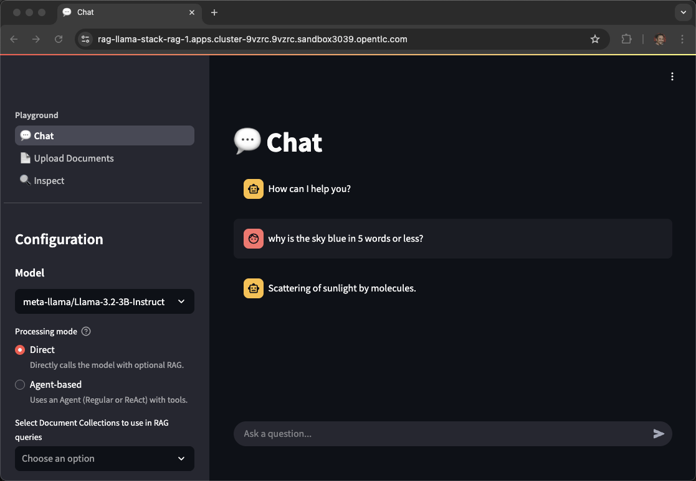
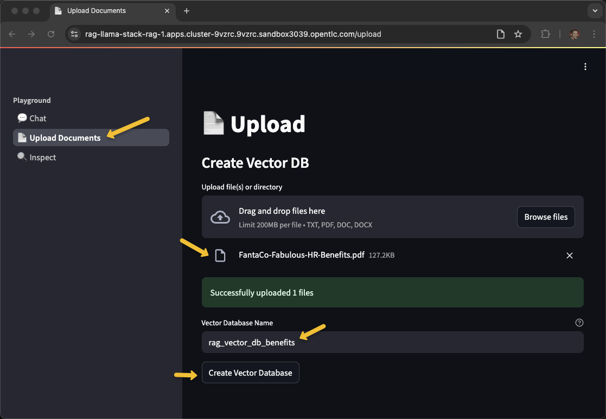

# RAG Reference Architecture using LLaMA Stack, OpenShift AI, and PGVector

## Description

Retrieval-Augmented Generation (RAG) enhances Large Language Models (LLMs) by retrieving relevant external knowledge to improve accuracy, reduce hallucinations, and support domain-specific conversations. This architecture uses:

- **OpenShift AI** for orchestration
- **LLaMA Stack** for standardizing the core building blocks and simplifying AI application development
- **PGVector** for semantic search
- **Kubeflow Pipelines** for data ingestion
- **Streamlit UI** for a user-friendly chatbot interface


---

## Architecture Diagram


*The architecture illustrates both the ingestion pipeline for document processing and the RAG pipeline for query handling. For more details click [here](docs/rag-reference-architecture.md).*

---

## Features

- Multi-Modal Data Ingestion for ingesting unstructured data
- Preprocessing pipelines for cleaning, chunking, and embedding generation using language models
- Vector Store Integration to store dense embeddings
- Integrates with LLMs to generate responses based on retrieved documents
- Streamlit based web application
- Runs on OpenShift AI for container orchestration and GPU acceleration
- Llama Stack to standardize the core building blocks and simplify AI application development
- Safety Guardrail to block harmful request / response
- Integration with MCP servers

---

## Ingestion Use Cases

### 1. BYOD (Bring Your Own Document)

End users can upload files through a UI and receive contextual answers based on uploaded content.

### 2. Pre-Ingestion

Enterprise documents are pre-processed and ingested into the system for later querying via OpenShift AI/Kubeflow Pipelines.

---

## Key Components

| Layer            | Component                      | Description |
|------------------|--------------------------------|-------------|
| **UI Layer**     | Streamlit / React              | Chat-based user interaction |
| **Retrieval**    | Retriever                      | Vector search |
| **Embedding**    | `all-MiniLM-L6-v2`             | Converts text to vectors |
| **Vector DB**    | PostgreSQL + PGVector          | Stores embeddings |
| **LLM**          | `Llama-3.2-3B-Instruct`        | Generates responses |
| **Ingestor**     |  Kubeflow Pipeline             | Embeds documents and stores vectors |
| **Storage**      |  S3 Bucket                     | Document source |

---

## Scalability & Performance

- KServe for auto-scaling the model and embedding pods
- GPU-based inference optimized using node selectors
- Horizontal scaling of ingestion and retrieval components

---

The quickstart supports two modes of deployments

- Local
- Openshift

## OpenShift Installation

### Minimum Requirements

- OpenShift Cluster 4.16+ with OpenShift AI
- OpenShift Client CLI - [oc](https://docs.redhat.com/en/documentation/openshift_container_platform/4.18/html/cli_tools/openshift-cli-oc#installing-openshift-cli)
- Helm CLI - helm
- [huggingface-cli](https://huggingface.co/docs/huggingface_hub/guides/cli) (optional)
- 1 GPU with 24GB of VRAM for the LLM, refer to the chart below
- 1 GPU with 24GB of VRAM for the safety/shield model (optional)
- [Hugging Face Token](https://huggingface.co/settings/tokens)
- Access to [Meta Llama](https://huggingface.co/meta-llama/Llama-3.2-3B-Instruct/) model.
- Access to [Meta Llama Guard](https://huggingface.co/meta-llama/Llama-Guard-3-8B/) model.
- Some of the example scripts use `jq` a JSON parsing utility which you can acquire via `brew install jq`

### Supported Models

| Function    | Model Name                             | GPU         | AWS
|-------------|----------------------------------------|-------------|-------------
| Embedding   | `all-MiniLM-L6-v2`                     | CPU or GPU  |
| Generation  | `meta-llama/Llama-3.2-3B-Instruct`     | L4          | g6.2xlarge
| Generation  | `meta-llama/Llama-3.1-8B-Instruct`     | L4          | g6.2xlarge
| Generation  | `meta-llama/Meta-Llama-3-70B-Instruct` | A100 x2     | p4d.24xlarge
| Safety      | `meta-llama/Llama-Guard-3-8B`          | L4          | g6.2xlarge

Note: the 70B model is NOT required for initial testing of this example.  The safety/shield model `Llama-Guard-3-8B` is also optional. 

---

#### Installation steps

1. Clone the repo so you have a working copy

```bash
git clone https://github.com/rh-ai-quickstart/RAG
```

2. Login to your OpenShift Cluster

```bash
oc login --server="<cluster-api-endpoint>" --token="sha256~XYZ"
```

3. If the GPU nodes are tainted, find the taint key. You will have to pass in the
   make command to ensure that the llm pods are deployed on the tainted nodes with GPU.
   In the example below the key for the taint is `nvidia.com/gpu`


```bash
oc get nodes -l nvidia.com/gpu.present=true -o yaml | grep -A 3 taint 
```
The output of the command may be something like below
```
  taints:
    - effect: NoSchedule
      key: nvidia.com/gpu
      value: "true"
--
    taints:
    - effect: NoSchedule
      key: nvidia.com/gpu
      value: "true"
```

You can work with your OpenShift cluster admin team to determine what labels and taints identify GPU-enabled worker nodes.  It is also possible that all your worker nodes have GPUs therefore have no distinguishing taint.

4. Navigate to Helm deploy directory

```bash
cd deploy/helm
```

5. List available models

```bash
make list-models
```

The above command will list the models to use in the next command

```bash
(Output)
model: llama-3-1-8b-instruct (meta-llama/Llama-3.1-8B-Instruct)
model: llama-3-2-1b-instruct (meta-llama/Llama-3.2-1B-Instruct)
model: llama-3-2-1b-instruct-quantized (RedHatAI/Llama-3.2-1B-Instruct-quantized.w8a8)
model: llama-3-2-3b-instruct (meta-llama/Llama-3.2-3B-Instruct)
model: llama-3-3-70b-instruct (meta-llama/Llama-3.3-70B-Instruct)
model: llama-guard-3-1b (meta-llama/Llama-Guard-3-1B)
model: llama-guard-3-8b (meta-llama/Llama-Guard-3-8B)
```

The "guard" models can be used to test shields for profanity, hate speech, violence, etc.

6. Install via make

Use the taint key from above as the `LLM_TOLERATION` and `SAFETY_TOLERATION`

The namespace will be auto-created

To install only the RAG example, no shields, use the following command:

```bash
make install NAMESPACE=llama-stack-rag LLM=llama-3-2-3b-instruct LLM_TOLERATION="nvidia.com/gpu"
```

To install both the RAG example as well as the guard model to allow for shields, use the following command:

```bash
make install NAMESPACE=llama-stack-rag LLM=llama-3-2-3b-instruct LLM_TOLERATION="nvidia.com/gpu" SAFETY=llama-guard-3-8b SAFETY_TOLERATION="nvidia.com/gpu"
```

If you have no tainted nodes, perhaps every worker node has a GPU, then you can use a simplified version of the make command

```bash
make install NAMESPACE=llama-stack-rag LLM=llama-3-2-3b-instruct SAFETY=llama-guard-3-8b
```

When prompted, enter your **[Hugging Face Token]((https://huggingface.co/settings/tokens))**.

Note: This process may take 10 to 30 minutes depending on the number and size of models to be downloaded. 

7. Watch/Monitor

```bash
oc get pods -n llama-stack-rag
```

```
(Output)
NAME                                                               READY   STATUS      RESTARTS   AGE
demo-rag-vector-db-v1-0-8mkf9                                      0/1     Completed   0          10m
ds-pipeline-dspa-7788689675-9489m                                  2/2     Running     0          10m
ds-pipeline-metadata-envoy-dspa-948676f89-8knw8                    2/2     Running     0          10m
ds-pipeline-metadata-grpc-dspa-7b4bf6c977-cb72m                    1/1     Running     0          10m
ds-pipeline-persistenceagent-dspa-ff9bdfc76-ngddb                  1/1     Running     0          10m
ds-pipeline-scheduledworkflow-dspa-7b64d87fd8-58d87                1/1     Running     0          10m
ds-pipeline-workflow-controller-dspa-5799548b68-bxpdp              1/1     Running     0          10m
fetch-and-store-pipeline-tmxwj-system-container-driver-287597120   0/2     Completed   0          3m43s
fetch-and-store-pipeline-tmxwj-system-container-driver-922184592   0/2     Completed   0          2m54s
fetch-and-store-pipeline-tmxwj-system-container-impl-3210250134    0/2     Completed   0          4m33s
fetch-and-store-pipeline-tmxwj-system-container-impl-3248801382    0/2     Completed   0          3m32s
fetch-and-store-pipeline-tmxwj-system-dag-driver-3443954210        0/2     Completed   0          4m6s
llama-3-2-3b-instruct-predictor-00001-deployment-6bbf96f8674677    3/3     Running     0          10m
llamastack-6d5c5b999b-5lffb                                        1/1     Running     0          11m
mariadb-dspa-74744d65bd-fdxjd                                      1/1     Running     0          10m
minio-0                                                            1/1     Running     0          10m
minio-dspa-7bb47d68b4-nvw7t                                        1/1     Running     0          10m
pgvector-0                                                         1/1     Running     0          10m
rag-7fd7b47844-nlfvr                                               1/1     Running     0          11m
rag-mcp-weather-9cc97d574-nf5q8                                    1/1     Running     0          11m
rag-pipeline-notebook-0                                            2/2     Running     0          10m
upload-sample-docs-job-f5k5w                                       0/1     Completed   0          10m
```

8. Verify:

```bash
oc get pods -n llama-stack-rag
oc get svc -n llama-stack-rag
oc get routes -n llama-stack-rag
```

Note: The key pods to watch include **predictor** in their name, those are the kserve model servers running vLLM

```bash
oc get pods -l component=predictor
```

Look for **3/3** under the Ready column

The **inferenceservice** CR describes the limits, requests, model name, serving-runtime, chat-template, etc. 

```bash
oc get inferenceservice llama-3-2-3b-instruct \
  -n llama-stack-rag-1 \
  -o jsonpath='{.spec.predictor.model}' | jq
```

Watch the **llamastack** pod as that one becomes available after all the model servers are up.

```bash
 oc get pods -l app.kubernetes.io/name=llamastack
```

### Using the RAG UI

1. Get the route url for the application and open in your browser

```bash
URL=http://$(oc get routes -l app.kubernetes.io/name=rag -o jsonpath="{range .items[*]}{.status.ingress[0].host}{end}")
echo $URL
open $URL
```



2. Click on **Upload Documents**

3. Upload your PDF document

4. Name and Create a Vector Database



5. Once you've recieved **Vector database created successfully!**, navigate back to **Chat** and select the newly created vector db.


6. Ask a question pertaining to your document!


Refer to the [post installation](docs/post_installation.md) document for batch document ingestion.

## Uninstalling the RAG application

```bash
make uninstall NAMESPACE=llama-stack-rag
```
or

```bash
oc delete project llama-stack-rag
```

## Adding a new model
To add another model follow these steps:

1. Edit `deploy\helm\rag\values.yaml` 

    Update the **global\models** section
    ```yaml
    global:
      models:
        granite-vision-3-2-2b:
          id: ibm-granite/granite-vision-3.2-2b
          enabled: true      
          resources:
            limits:
              nvidia.com/gpu: "1"
          tolerations:
          - key: "nvidia.com/gpu"
            operator: Exists
            effect: NoSchedule
          args:
          - --tensor-parallel-size
          - "1"
          - --max-model-len
          - "6144"
          - --enable-auto-tool-choice
          - --tool-call-parser
          - granite
        llama-guard-3-8b:
          id: meta-llama/Llama-Guard-3-8B
          enabled: true
          registerShield: true
          tolerations:
          - key: "nvidia.com/gpu"
            operator: Exists
            effect: NoSchedule
          args:
          - --max-model-len
          - "14336"
    ```

  Note: Make sure you have permission to download the models from Huggingface and enough GPUs to support all the models you have requested.  Also **max-model-len** uses additional VRAM therefore you have to scale that parameter to fit your hardware. 

2. Run the **make** command again to update the project

    ```bash
    make install NAMESPACE=llama-stack-rag LLM=llama-3-2-3b-instruct LLM_TOLERATION="nvidia.com/gpu"
    ```

    ```bash
    (Output)
    NAME                                                                READY   STATUS                   RESTARTS      AGE
    demo-rag-vector-db-v1-0-vz5mf                                       0/1     Completed                0             35m
    ds-pipeline-dspa-6dcf8c7b8f-vkhw8                                   2/2     Running                  1 (34m ago)   34m
    ds-pipeline-metadata-envoy-dspa-7659ddc8d9-qvtct                    2/2     Running                  0             34m
    ds-pipeline-metadata-grpc-dspa-8665cd5c6c-mfrj7                     1/1     Running                  0             34m
    ds-pipeline-persistenceagent-dspa-56f888bc78-lzq9s                  1/1     Running                  0             34m
    ds-pipeline-scheduledworkflow-dspa-c94d5c95d-rr8td                  1/1     Running                  0             34m
    ds-pipeline-workflow-controller-dspa-5799548b68-z2lcl               1/1     Running                  0             34m
    fetch-and-store-pipeline-w7gxh-system-container-driver-1552269565   0/2     Completed                0             30m
    fetch-and-store-pipeline-w7gxh-system-container-driver-2057025395   0/2     Completed                0             30m
    fetch-and-store-pipeline-w7gxh-system-container-impl-1487941461     0/2     Completed                0             30m
    fetch-and-store-pipeline-w7gxh-system-container-impl-883889707      0/2     Completed                0             29m
    fetch-and-store-pipeline-w7gxh-system-dag-driver-190510417          0/2     Completed                0             30m
    granite-vision-3-2-2b-predictor-00001-deployment-5dbcf6f454mrd6     3/3     Running                  0             10m
    granite-vision-3-2-2b-predictor-00001-deployment-5dbcf6f45xxk5x     0/3     ContainerStatusUnknown   3             13m
    llama-3-2-3b-instruct-predictor-00001-deployment-6f845f65674ncq     3/3     Running                  0             35m
    llama-guard-3-8b-predictor-00001-deployment-6cbff4965c-gzx5v        3/3     Running                  0             13m
    llamastack-7989d974fc-w24fn                                         1/1     Running                  0             13m
    mariadb-dspa-74744d65bd-kb2dh                                       1/1     Running                  0             35m
    minio-0                                                             1/1     Running                  0             35m
    minio-dspa-7bb47d68b4-kb722                                         1/1     Running                  0             35m
    pgvector-0                                                          1/1     Running                  0             35m
    rag-7fd7b47844-jkqtf                                                1/1     Running                  0             35m
    rag-mcp-weather-9cc97d574-s8vpt                                     1/1     Running                  0             35m
    rag-pipeline-notebook-0                                             2/2     Running                  0             35m
    upload-sample-docs-job-952gj                                        0/1     Completed                0             35m
    ```

Return to the RAG UI and look into the **Inspect** tab to see the additional models and shields. 


The newly added shield can be tested via the UI by selecting **Agent-based** and Chat


## Local Development Setup

Refer to the [local setup guide](docs/local_setup_guide.md) document for configuring your workstation for code changes and local testing.


