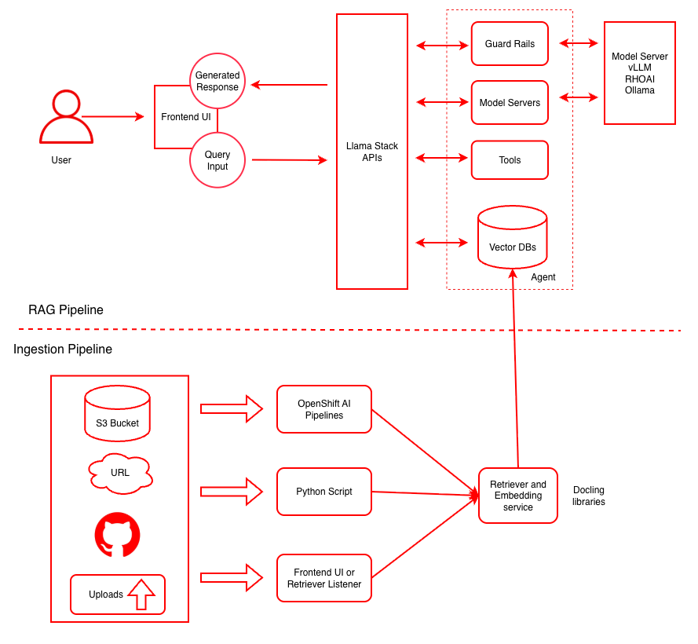

<!-- omit from toc -->
# Centralize company knowledge with an Enterprise RAG Chatbot

[](https://github.com/rh-ai-quickstart/RAG/releases)
[](https://quay.io/repository/rh-ai-quickstart/llamastack-dist-ui)

Use retrieval-augmented generation (RAG) to enhance large language models with specialized data sources for more accurate and context-aware responses.

<!-- omit from toc -->
## Table of Contents
- [Detailed description](#detailed-description)
  - [Architecture diagrams](#architecture-diagrams)
- [Requirements](#requirements)
  - [Minimum hardware requirements](#minimum-hardware-requirements)
  - [Minimum software requirements](#minimum-software-requirements)
  - [Required user permissions](#required-user-permissions)
- [Deploy](#deploy)
  - [Prerequisites](#prerequisites)
  - [Supported Models](#supported-models)
  - [Installation Steps](#installation-steps)
  - [Local Deployment](#local-deployment)
- [Tags](#tags)


## Detailed description

See how FantaCo, a fictional large enterprise, launched a secure RAG chatbot that connects employees to internal HR, procurement, sales, and IT documentation. From policies to startup guides, employees get fast, accurate answers through a single chat interface. Advanced users can extend the experience with AI agents for deeper workflows. 

Retrieval-Augmented Generation (RAG) enhances Large Language Models (LLMs) by retrieving relevant external knowledge to improve accuracy, reduce hallucinations, and support domain-specific conversations.

This QuickStart allows users to explore the capabilities of RAG by:

- Exploring FantaCo's solution
- Uploading new documents to be embedded
- Tweaking sampling parameters to influence LLM responses
- Using custom system prompts
- Switching between simple and agent based RAG


### Architecture diagrams


*This diagram illustrates both the ingestion pipeline for document processing and the RAG pipeline for query handling. For more details click [here](docs/rag-reference-architecture.md).*

| Layer/Component | Technology | Purpose/Description |
|-----------------|------------|---------------------|
| **Orchestration** | OpenShift AI | Container orchestration and GPU acceleration |
| **Framework** | LLaMA Stack | Standardizes core building blocks and simplifies AI application development |
| **UI Layer** | Streamlit | User-friendly chatbot interface for chat-based interaction |
| **LLM** | Llama-3.2-3B-Instruct | Generates contextual responses based on retrieved documents |
| **Safety** | Safety Guardrail | Blocks harmful requests and responses for secure AI interactions |
| **Integration** | MCP Servers | Model Context Protocol servers for enhanced functionality |
| **Embedding** | all-MiniLM-L6-v2 | Converts text to vector embeddings |
| **Vector DB** | PostgreSQL + PGVector | Stores embeddings and enables semantic search |
| **Retrieval** | Vector Search | Retrieves relevant documents based on query similarity |
| **Data Ingestion** | Kubeflow Pipelines | Multi-modal data ingestion with preprocessing pipelines for cleaning, chunking, and embedding generation |
| **Storage** | S3 Bucket | Document source for enterprise content |


## Requirements 

### Minimum hardware requirements 
- 1 GPU/HPU with 24GB of VRAM for the LLM, refer to the [chart below](#supported-models)
- 1 GPU/HPU with 24GB of VRAM for the safety/shield model (optional)
- Xeon deployments: one worker node with Intel Xeon processors, Sapphire Rapids (SPR) or newer (EMR/GNR)
  - for example: m8i.8xlarge, m7i.8xlarge, r8i.8xlarge
  - vLLM requires a minimum of 16 vCPUs and 64 GB of RAM to run

### Minimum software requirements 
- OpenShift Client CLI - [oc](https://docs.redhat.com/en/documentation/openshift_container_platform/4.18/html/cli_tools/openshift-cli-oc#installing-openshift-cli)
- OpenShift Cluster 4.18+
- OpenShift AI
- Helm CLI - helm

### Required user permissions 
- Regular user permission for default deployment
- Cluster admin required for *advanced* configurations


## Deploy

*The instructions below will deploy this quickstart to your OpenShift environment.*

*Please see the [local deployments](#local-deployment) section for additional deployment options.* 

### Prerequisites
- [huggingface-cli](https://huggingface.co/docs/huggingface_hub/guides/cli) (optional)
- [Hugging Face Token](https://huggingface.co/settings/tokens)
- Access to [Meta Llama](https://huggingface.co/meta-llama/Llama-3.2-3B-Instruct/) model
- Access to [Meta Llama Guard](https://huggingface.co/meta-llama/Llama-Guard-3-8B/) model
- Some of the example scripts use `jq` a JSON parsing utility which you can acquire via `brew install jq`

### Supported Models

| Function    | Model Name                             | Hardware    | AWS
|-------------|----------------------------------------|-------------|-------------
| Embedding   | `all-MiniLM-L6-v2`                     | CPU/GPU/HPU |
| Generation  | `meta-llama/Llama-3.2-3B-Instruct`     | L4<br>HPU<br>Xeon | g6.2xlarge<br>N/A<br>m8i.8xlarge
| Generation  | `meta-llama/Llama-3.1-8B-Instruct`     | L4<br>HPU<br>Xeon | g6.2xlarge<br>N/A<br>m8i.8xlarge
| Generation  | `meta-llama/Meta-Llama-3-70B-Instruct` | A100 x2/HPU | p4d.24xlarge
| Safety      | `meta-llama/Llama-Guard-3-8B`          | L4/HPU      | g6.2xlarge

- Note: Developers can also configure a remote LLM by modifying the `rag_values.yml` file, which gives you complete control over all parameter settings.

```yaml
  remote-llm:
    id: llama-3-3-70b-instruct-w8a8
    url: https://somedomain.com/v1
    apiToken: fake-token
    enabled: true
```

Note: the 70B model is NOT required for initial testing of this example. The safety/shield model `Llama-Guard-3-8B` is also optional.

### Installation Steps

1. **Clone Repository**

```bash
git clone https://github.com/rh-ai-quickstart/RAG
```

2. **Login to OpenShift**

```bash
oc login --server="<cluster-api-endpoint>" --token="sha256~XYZ"
```

3. **Hardware Configuration**

Determine what hardware acceleration is available in your cluster and configure accordingly.

**For NVIDIA GPU nodes**: If GPU nodes are tainted, find the taint key. In the example below the key for the taint is `nvidia.com/gpu`

```bash
oc get nodes -l nvidia.com/gpu.present=true -o yaml | grep -A 3 taint 
```

**For Intel Gaudi HPU nodes**: If HPU nodes are tainted, find the taint key. The taint key is typically `habana.ai/gaudi`

```bash
oc get nodes -l habana.ai/gaudi.present=true -o yaml | grep -A 3 taint 
```

The output of either command may be something like below:
```
taints:
  - effect: NoSchedule
    key: nvidia.com/gpu  # or habana.ai/gaudi for HPU
    value: "true"
```

You can work with your OpenShift cluster admin team to determine what labels and taints identify GPU-enabled or HPU-enabled worker nodes. It is also possible that all your worker nodes have accelerators therefore have no distinguishing taint.

4. **Navigate to Deployment Directory**

```bash
cd deploy/helm
```

5. **List Available Models**

```bash
make list-models
```

The above command will list the models to use in the next command:

```bash
(Output)
model: llama-3-1-8b-instruct (meta-llama/Llama-3.1-8B-Instruct)
model: llama-3-2-1b-instruct (meta-llama/Llama-3.2-1B-Instruct)
model: llama-3-2-1b-instruct-quantized (RedHatAI/Llama-3.2-1B-Instruct-quantized.w8a8)
model: llama-3-2-3b-instruct (meta-llama/Llama-3.2-3B-Instruct)
model: llama-3-3-70b-instruct (meta-llama/Llama-3.3-70B-Instruct)
model: llama-guard-3-1b (meta-llama/Llama-Guard-3-1B)
model: llama-guard-3-8b (meta-llama/Llama-Guard-3-8B)
```

The "guard" models can be used to test shields for profanity, hate speech, violence, etc.

6. **Deploy with Helm**

Use the taint key from above as the `LLM_TOLERATION` and `SAFETY_TOLERATION`. The namespace will be auto-created.

> **Note Running just `make install` from the deploy/helm directory will create a rag_values.yml file which can be edited to use in deployments.**

**GPU Deployment Examples (Default):**

To install only the RAG example, no shields:

```bash
make install NAMESPACE=llama-stack-rag LLM=llama-3-2-3b-instruct LLM_TOLERATION="nvidia.com/gpu"
```

To install both the RAG example as well as the guard model to allow for shields:

```bash
make install NAMESPACE=llama-stack-rag LLM=llama-3-2-3b-instruct LLM_TOLERATION="nvidia.com/gpu" SAFETY=llama-guard-3-8b SAFETY_TOLERATION="nvidia.com/gpu"
```

*Note: `DEVICE=gpu` is the default and can be omitted.*

**Intel Gaudi HPU Deployment Examples:**

To install only the RAG example on Intel Gaudi HPU nodes:

```bash
make install NAMESPACE=llama-stack-rag LLM=llama-3-2-3b-instruct LLM_TOLERATION="habana.ai/gaudi" DEVICE=hpu
```

To install both the RAG example and guard model on Intel Gaudi HPU nodes:

```bash
make install NAMESPACE=llama-stack-rag LLM=llama-3-2-3b-instruct LLM_TOLERATION="habana.ai/gaudi" SAFETY=llama-guard-3-8b SAFETY_TOLERATION="habana.ai/gaudi" DEVICE=hpu
```

**CPU Deployment Example:**

To install on CPU nodes only:

```bash
make install NAMESPACE=llama-stack-rag LLM=llama-3-2-3b-instruct DEVICE=cpu
```

**Xeon Deployment Example:**
To install on Xeon nodes only:

```bash
make install NAMESPACE=llama-stack-rag LLM=llama-3-2-3b-instruct DEVICE=xeon
```
- This assumes that all your worker nodes use Sapphire Rapids (SPR) or newer Intel Xeon processors.
- If you have heterogeneous worker nodes, work with your cluster administrator to identify SPR+ nodes and use taint keys, similar to the GPU and HPU deployments above, to set `LLM_TOLERATION` and `SAFETY_TOLERATION` to schedule on valid nodes.

**Simplified Commands (No Tolerations Needed):**

If you have no tainted nodes (all worker nodes have accelerators), you can use simplified commands:

```bash
# GPU deployment (default - DEVICE=gpu can be omitted)
make install NAMESPACE=llama-stack-rag LLM=llama-3-2-3b-instruct SAFETY=llama-guard-3-8b

# HPU deployment  
make install NAMESPACE=llama-stack-rag LLM=llama-3-2-3b-instruct SAFETY=llama-guard-3-8b DEVICE=hpu

# CPU deployment
make install NAMESPACE=llama-stack-rag LLM=llama-3-2-3b-instruct SAFETY=llama-guard-3-8b DEVICE=cpu

# Xeon deployment
make install NAMESPACE=llama-stack-rag LLM=llama-3-2-3b-instruct SAFETY=llama-guard-3-8b DEVICE=xeon

```

When prompted, enter your **[Hugging Face Token](https://huggingface.co/settings/tokens)**.

Note: This process may take 10 to 30 minutes depending on the number and size of models to be downloaded.

7. **Monitor Deployment**

```bash
oc get pods -n llama-stack-rag
```

Watch for all pods to reach Running or Completed status. Key pods to watch include **predictor** in their name (these are the KServe model servers running vLLM):

```bash
oc get pods -l component=predictor
```

Look for **3/3** under the Ready column.

8. **Verify Installation**

Watch the **llamastack** pod as that one becomes available after all the model servers are up:

```bash
oc get pods -l app.kubernetes.io/name=llamastack
```

Verify all resources:

```bash
oc get pods -n llama-stack-rag
oc get svc -n llama-stack-rag
oc get routes -n llama-stack-rag
```

For detailed post-installation verification, configuration options, and usage instructions, see the [complete OpenShift deployment guide](docs/openshift_setup_guide.md).

### Local Deployment

For local development and testing, see the [Local Setup Guide](docs/local_setup_guide.md).

## Tags

* **Product:** OpenShift AI
* **Use case:** RAG
* **Business challenge:** Adopt and scale AI
