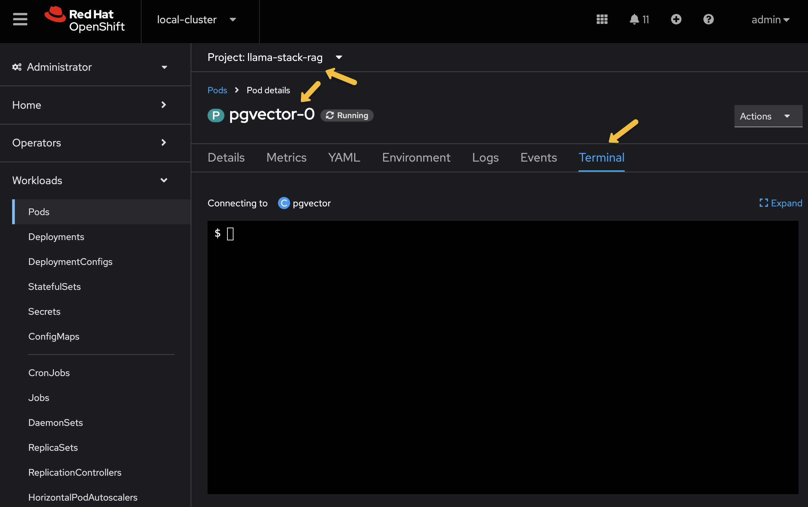

# Llama Stack Python Client SDK Examples


This is a series of example scripts for learning more about the capabilities of Llama Stack.  

## Setup

The scripts use some common environment variables to connect to the LLama Stack Server.  See the [local setup guide](../docs/local_setup_guide.md) for more information on how to start or connect to a Llama Stack Server

```bash
python3.11 -m venv .venv
source .venv/bin/activate  # macOS/Linux
# Windows:
# llama-stack-demo\Scripts\activate
```

```bash
pip install -r requirements.txt
```

```bash
export LLAMA_STACK_SERVER=http://localhost:8321
export LLAMA_STACK_SERVER_OPENAI=$LLAMA_STACK_SERVER/v1/openai/v1
```

Some examples use the direct Llama Stack endpoint while others use the OpenAI API compatible endpoint. 

## Models

Llama Stack registers models and model providers.  You can query the Llama Stack endpoint to find out the extract string needed to reference a model.

```bash
python list-models.py
```

This also proves connectivity to the correct LLama Stack server instance.  Identify the model you wish to work with and set another environment variable.

```bash
export INFERENCE_MODEL=meta-llama/Llama-3.2-3B-Instruct
```

## Chat Completions

Chat completions is the core API used for most LLM interactions.  

```bash
python chat-completions.py
```

The knowledge cutoff of most models means its knowlege is outdated.  The solution to the 2025 Super Bowl inquiry will be provided in the next section: Web Search

## Web Search

```bash
python list-tools.py
```

`builtin::websearch` should be listed, however, you will need to provide a `TAVILY_SEARCH_API_KEY` in the deploy/helm/rag/values.yaml and run the `make` command again.  You can acquire an Tavily API key here https://app.tavily.com/home

```
llama-stack:
  secrets:
    TAVILY_SEARCH_API_KEY: tvly-mykey
  mcp-servers: {}
    #  mcp-weather:
    #   uri: http://rag-mcp-weather:8000/sse
```

```bash
python web-search.py
```


## Shields

Shields provide input and output guardrails to block unwanted content

```bash
python list-shields.py
```

You can register a shield that maps to a guard model easily

```bash
python register-shield.py
```

And then use that shield during LLM calls to block `How do I kindnap someone?`

```bash
python test-shield.py
```


## RAG

Extend the model's knowlege via the retrieval augmented generation pattern.

Ask the Llama Server for a listing of current vector databases and providers. 

```bash
python rag-list-vector-db.py
```

Create a vector db based on the `pgvector` provider called `ragged-db`

```bash
python rag-create-vector-db.py
```

List out the vector dbs to see that the vector-db is created

```bash
python rag-list-vector-db.py
```

Test with a query

```bash
python rag-use-vector-db.py
```

```
(Output)
What is the Grand Invention?:  The Grand Invention is the Zippity-Whizzer, a contraption that Zippity Zoo invented to turn rain into fizzer, a bubbly, sparkly, and glowing drink that tastes like the sun mixed with glitter and fizz.
```

When you are finished you can optionally delete the vector-db

```bash
python rag-delete-vector-db.py
```

### Behind the scenes

The postgresql pod and terminal is accessible via the OpenShift console.



You may need to hit enter for the prompt to appear.

```bash
psql -U postgres
```

```
\c rag_blueprint
```


```bash
rag_blueprint=# \dt
                        List of relations
 Schema |                 Name                 | Type  |  Owner   
--------+--------------------------------------+-------+----------
 public | metadata_store                       | table | postgres
 public | vector_store_demo_rag_vector_db_v1_0 | table | postgres
 public | vector_store_ragged_db               | table | postgres
(3 rows)
```

The "vector_store_ragged_db" is the one created and ingests the sample PDF.  It is seen as a table inside of Postgres with rows containing the chunked content.

```
select count(*) as row_count from vector_store_ragged_db;
```

